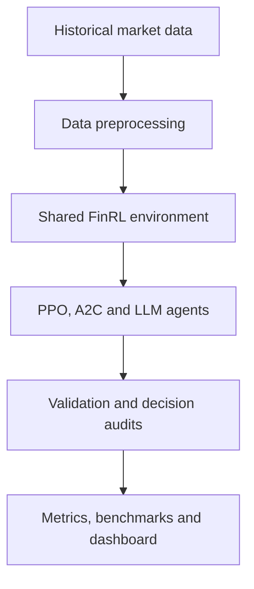

# Msc-dissertation

# Evaluating LLM and Deep Reinforcement Learning Trading Agents in FinRL
A controlled comparison of a large language model trading agent with Proximal Policy Optimisation (PPO) and Advantage Actor-Critic (A2C) in a shared financial trading environment.

This repository contains the code, validated outputs and interactive dashboard developed for my MSc Data Science and Artificial Intelligence dissertation at the University of Liverpool.

> This project is academic research and does not provide financial or investment advice.

## Project overview

Large language models are increasingly being used as autonomous agents, but evaluating them fairly against established decision-making methods remains difficult. Differences in environments, data, decision frequency and failure handling can make apparently strong results unreliable.

This project addresses that problem through a controlled FinRL benchmark. An LLM-based trading agent is evaluated alongside two deep reinforcement learning agents under consistent market conditions.

The comparison includes:

- Proximal Policy Optimisation (PPO)
- Advantage Actor-Critic (A2C)
- An LLM-based trading agent
- Buy-and-hold benchmark
- Equal-weight portfolio benchmark
- Dow Jones Industrial Average benchmark

The emphasis is not only on portfolio returns, but also on experimental reliability, risk, decision consistency and transparent handling of failed LLM calls.

## Academic context

| Item | Details |
|---|---|
| Programme | MSc Data Science and Artificial Intelligence |
| Institution | University of Liverpool |
| Project type | MSc dissertation |
| Research area | LLM agents, reinforcement learning and financial decision-making |
| Environment | FinRL `StockTradingEnv` |
| Status | Completed |
| Completion date | September 2026 |

## Research aim

The project aims to determine how an LLM-based agent compares with established deep reinforcement learning agents when all strategies operate within the same financial trading environment.

It examines:

1. How PPO, A2C and an LLM agent behave under consistent market information and trading constraints.
2. How the agents compare in terms of portfolio performance and risk.
3. Whether differences in decision-making can be observed through action-level audits.
4. How API rate limits, token exhaustion and invalid responses affect the reliability of LLM-agent evaluation.
5. How a reproducible benchmark can be designed for evaluating different types of AI agents fairly.

## Main contributions

The repository provides:

- A shared FinRL environment for comparing LLM and DRL agents.
- Consistent data, capital, indicators and transaction-cost assumptions.
- PPO and A2C baselines implemented using Stable-Baselines3.
- An LLM agent using structured portfolio decisions.
- Buy-and-hold, equal-weight and DJIA market benchmarks.
- Decision-level audit trails for the evaluated agents.
- Checkpointing and structured-output validation for LLM calls.
- Detection and exclusion of invalid experimental runs.
- Bootstrap confidence intervals for Sharpe-ratio estimates.
- An interactive Streamlit dashboard for exploring the results.

## Evaluation pipeline



## Agents

| Agent | Category | Description |
|---|---|---|
| PPO | Deep reinforcement learning | Learns a trading policy using Proximal Policy Optimisation. |
| A2C | Deep reinforcement learning | Uses an actor-critic architecture to learn portfolio actions. |
| LLM agent | Language-model agent | Converts market observations and technical indicators into structured trading decisions. |

The final LLM experiment used `openai/gpt-oss-120b` through the Groq API.

## Market benchmarks

Three non-agent strategies are included to provide context for the results.

| Benchmark | Purpose |
|---|---|
| Buy and Hold | Measures performance from holding the selected assets without active reallocation. |
| Equal Weight | Represents a simple diversified portfolio with equal allocation across assets. |
| DJIA | Provides a broader market-index comparison. |

These benchmarks help determine whether additional model complexity produces meaningful improvements over simpler approaches.

## Experimental design

All evaluated agents use a shared configuration defined in `config.py`.

The controlled setup includes:

- A fixed stock universe.
- Identical training and evaluation data.
- The same initial portfolio capital.
- Consistent transaction costs.
- A common set of technical indicators.
- The same evaluation dates.
- A consistent decision schedule.
- Shared portfolio-accounting rules.
- Common performance and risk metrics.

Using the same environment reduces the likelihood that differences in performance are caused by inconsistent experimental conditions.

## Final evaluation

The final comparison is based on a validated five-day agent benchmark.

This shorter benchmark was selected after API token and rate limits made the original long-duration LLM experiment unreliable. The PPO and A2C outputs were aligned with the final decision schedule so that their actions could be compared with the LLM under equivalent evaluation conditions.

The short horizon means that the experiment should be interpreted as a controlled comparison of agent behaviour rather than evidence of long-term trading profitability.

## Performance evaluation

The evaluation covers portfolio performance, risk and trading behaviour.

Metrics include:

- Final portfolio value
- Total return
- Risk-adjusted return
- Sharpe ratio
- Portfolio volatility
- Maximum drawdown
- Trading activity
- Portfolio turnover
- Performance relative to market benchmarks

The repository also contains:

- Agent equity curves
- Benchmark equity curves
- Daily or scheduled portfolio actions
- LLM reasoning records
- Decision-audit files
- Bootstrap confidence intervals
- Validation outputs

## Reliability and validation

Reliability was a central part of the research because an LLM trading experiment can appear to complete successfully even when API failures have affected its decisions.

During an earlier run, the LLM reached API token limits and defaulted to holding existing positions for a substantial part of the evaluation period. Although the portfolio continued to produce values, those values no longer represented genuine LLM decisions.

That run was invalidated and excluded from the final results.

The final pipeline therefore includes:

- Checkpointed LLM decisions.
- Atomic saving of actions and portfolio states.
- Structured JSON-response validation.
- Token-usage monitoring.
- Rate-limit detection and safety pauses.
- Resume functionality.
- Decision-level audit files.
- Separation of invalid and validated runs.
- Consistency checks across portfolio outputs.
- Statistical confidence-interval estimation.

This process demonstrates why infrastructure failures must be treated as part of agent evaluation rather than as unrelated technical problems.

## Results and interpretation

The final outputs allow the three agents to be compared with one another and with the market benchmarks.

The analysis focuses on:

- Differences in portfolio value and return.
- Risk-adjusted performance.
- Maximum drawdown and volatility.
- The direction and size of agent actions.
- Whether agents trade actively or maintain existing positions.
- Performance relative to simpler benchmark strategies.
- Uncertainty in short-horizon Sharpe-ratio estimates.

Because the final comparison contains only five validated evaluation days, small differences should not be interpreted as evidence that one agent is universally superior. The experiment primarily demonstrates a transparent and reproducible framework for comparing different agent architectures.

The numerical results, equity curves and audit records are available in the [`results`](results/) directory.

## Interactive dashboard

The Streamlit dashboard presents the experimental results in an accessible and interactive format.

It supports:

- Side-by-side agent comparisons.
- Interactive equity curves.
- Portfolio and risk-metric summaries.
- Market benchmark overlays.
- Inspection of individual agent decisions.
- Comparison across market conditions.
- Exploration of validated result files.

To launch the dashboard from the repository root:

```bash
streamlit run dashboard/app.py
```

## Repository structure

```text
MSc-dissertation/
├── agents/
│   ├── agent implementations
│   ├── DRL training and backtesting
│   ├── LLM decision pipeline
│   └── backtest_drl_weekly.py
│
├── dashboard/
│   └── Streamlit dashboard and visualisation code
│
├── data/
│   ├── training data
│   └── evaluation data
│
├── evaluation/
│   ├── performance metrics
│   ├── result validation
│   ├── bootstrap_ci.py
│   └── djia_index.py
│
├── results/
│   ├── agent equity curves
│   ├── benchmark equity curves
│   ├── decision audits
│   ├── performance metrics
│   └── bootstrap confidence intervals
│
├── config.py
└── README.md
```

## Key output files

| File | Purpose |
|---|---|
| `results/ppo_weekly_decision_audit.csv` | Auditable record of PPO decisions. |
| `results/a2c_weekly_decision_audit.csv` | Auditable record of A2C decisions. |
| `results/bootstrap_sharpe_ci.csv` | Bootstrap confidence intervals for Sharpe-ratio estimates. |
| `results/djia_equity_curve.csv` | DJIA benchmark equity curve. |
| `evaluation/bootstrap_ci.py` | Produces statistical confidence intervals. |
| `evaluation/djia_index.py` | Prepares the DJIA benchmark. |
| `agents/backtest_drl_weekly.py` | Aligns DRL evaluation with the final decision schedule. |

Additional validated equity curves, action records and performance summaries are stored in the `results/` directory.

## Technology stack

- Python
- FinRL
- Stable-Baselines3
- PyTorch
- Pandas
- NumPy
- Matplotlib
- Plotly
- Streamlit
- Groq API
- Bootstrap statistical analysis

## Reproducing the analysis

### 1. Clone the repository

```bash
git clone https://github.com/ayshazia14/MSc-dissertation.git
cd MSc-dissertation
```

### 2. Create a virtual environment

On macOS or Linux:

```bash
python -m venv venv
source venv/bin/activate
```

### 3. Configure the experiment

Shared dates, assets, capital, transaction costs and technical indicators are defined in:

```text
config.py
```

Review this file before rerunning an experiment.

### 4. Configure the LLM API

A Groq API key is required only when generating new LLM decisions. It is not required to inspect the saved results.

Store the key as an environment variable:

```bash
export GROQ_API_KEY="your-api-key"
```

API keys should never be committed to GitHub.

### 5. Generate supporting evaluations

Relevant evaluation scripts include:

```bash
python evaluation/djia_index.py
python agents/backtest_drl_weekly.py
python evaluation/bootstrap_ci.py
```

### 6. Explore the results

The committed outputs can be inspected directly in the `results/` directory or through the Streamlit dashboard:

```bash
streamlit run dashboard/app.py
```

## Limitations

- The final direct agent comparison uses a five-day evaluation horizon because of LLM API token and rate constraints.
- Results may be sensitive to the selected dates, market conditions and technical indicators.
- LLM and DRL agents learn and make decisions differently, so complete methodological equivalence is not possible.
- Short-window financial metrics can be unstable and should be interpreted cautiously.
- Historical backtesting does not represent live trading performance.
- The experiment does not account fully for liquidity, slippage or market impact.
- Results from one evaluation period cannot establish long-term agent superiority.

## Future work

Future extensions could include:

- Evaluating agents over longer time horizons.
- Repeating experiments across multiple market regimes.
- Testing multiple random seeds for DRL agents.
- Comparing additional reinforcement learning algorithms.
- Evaluating different LLM providers and model sizes.
- Incorporating financial news and textual market information.
- Measuring inference cost and decision latency.
- Modelling slippage, liquidity and market impact.
- Investigating hybrid LLM–DRL agents.
- Testing the framework across other financial markets.

## Responsible use

This repository was created for academic research and educational purposes.

The agents operate on historical data within a simulated environment. Their outputs should not be interpreted as financial advice, investment recommendations or evidence of future profitability.

## Author

**Aysha Ziaulhaque**  
MSc Data Science and Artificial Intelligence  

## Acknowledgement

This work was completed as an MSc dissertation at the University of Liverpool.
